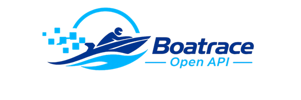

<p align="center">
    <a href="https://github.com/boatraceopenapi/api">
        
    </a>
</p>

[](https://github.com/boatraceopenapi/api/tree/gh-pages/docs/v1)
[](https://opensource.org/licenses/MIT)

[](https://github.com/boatraceopenapi/api/actions/workflows/pages/pages-build-deployment)
[](https://github.com/boatraceopenapi/api/actions/workflows/test.yml)
[](https://github.com/boatraceopenapi/api/actions/workflows/psalm.yml)
[](https://github.com/boatraceopenapi/api/actions/workflows/audit.yml)
[](https://github.com/boatraceopenapi/api/actions/workflows/sync.yml)
[](https://github.com/boatraceopenapi/api/actions/workflows/sync-upcoming.yml)
[](https://github.com/boatraceopenapi/api/actions/workflows/keepalive.yml)
[](https://github.com/boatraceopenapi/api/actions/workflows/dependabot/dependabot-updates)

## ⚠️ 注意事項

> **本 API を利用する前に、以下の内容をご確認ください。**
>
> - ⚡ **本 API は非公式です。**
>   BOATRACE 公式サイトおよび関連団体とは一切関係ありません。
>
> - 🕒 **データはリアルタイムではありません。**
>   GitHub Actions による約 3 分間隔の定期更新を行っています。リアルタイム配信ではないため、最新の情報が反映されるまで数分程度の遅れが生じる場合があります。
>
> - 📊 **データの正確性・完全性は保証していません。**
>   収集・変換の都合により、欠損や誤りが含まれる可能性があります。
>
> - 🚫 **公式な情報が必要な場合は、必ず BOATRACE 公式サイトをご確認ください。**
>
> - 🙇‍♂️ **本 API の利用は自己責任でお願いします。**

## 📌 概要

この API では、ボートレース（競艇）のデータを取得できます。<br>
データは GitHub Pages 上で公開されており、JSON 形式で提供されます。

- **対応レース場**: 全国 24 場すべてに対応しています。特定のレース場のみを取り出すエンドポイントはなく、1日分のデータに全場の情報が含まれます。
- **取得可能なデータ**: 出走表・直前情報・結果

## 🌐 エンドポイント

> 📅 対応期間: 2026年01月01日以降

```bash
https://boatraceopenapi.github.io/api/v1/YYYY/YYYYMMDD.json
```

📅 YYYY → 年<br>
📅 YYYYMMDD → 年月日<br>
（ 日付は日本標準時 JST〔UTC+9〕基準 ）

> **データが存在しない日付**（対応期間外・未来日付など）を指定した場合、GitHub Pages の仕様により **HTTP 404** が返されます。

## 📐 レスポンス仕様

レスポンスの JSON 構造・各フィールドの詳細については、スキーマドキュメントを参照してください。

- [docs/v1/schema.md](docs/v1/schema.md)

## 🧩 サンプル

- 2026年05月01日のデータ
  - [https://boatraceopenapi.github.io/api/v1/2026/20260501.json](https://boatraceopenapi.github.io/api/v1/2026/20260501.json)
- 当日のデータ
  - [https://boatraceopenapi.github.io/api/v1/today.json](https://boatraceopenapi.github.io/api/v1/today.json)

### コードサンプル

各言語でのデータ取得・パース例は [docs/v1/example.md](docs/v1/example.md) を参照してください。

## 🔍 turnmark/api との違い

同じくボートレース（競艇）のデータを提供する [turnmark/api](https://github.com/turnmark/api) とは、データの範囲や更新タイミングが異なります。用途に応じて使い分けてください。

| | 本 API（boatraceopenapi/api） | turnmark/api |
|---|---|---|
| **提供データ** | 出走表・直前情報・結果 | 出走表・直前情報・結果 **+ オッズ** |
| **対象期間** | 当日分を含む（可能な限り早く提供） | 前日までのデータ |
| **更新の考え方** | オッズを含まない分、データの速度を優先 | データの信頼性を優先 |

- 📊 **オッズが必要な場合** → [turnmark/api](https://github.com/turnmark/api) をご利用ください。
- ⚡ **当日データをできるだけ早く取得したい場合** → 本 API をご利用ください。

## 🤝 コントリビューション

> **Pull Request は受け付けておりません。**
>
> - 🐛 **バグ報告・不具合の指摘** → [Issues](../../issues) からお願いします。
> - 💡 **機能要望・改善提案** → こちらも [Issues](../../issues) からお願いします。
> - 🚧 個人開発のため、レビュー・メンテナンスのリソースが限られています。いただいた Issue は内容を確認の上、こちらで対応・実装を判断させていただきます。

## 📄 ライセンス

Boatrace Open API は [MIT license](LICENSE) の元で公開されています。
